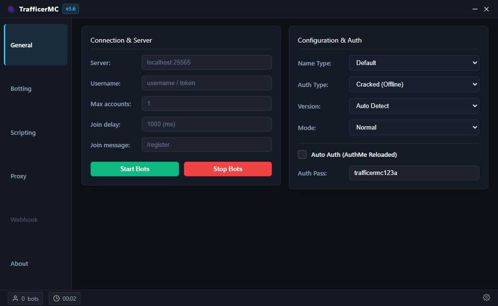
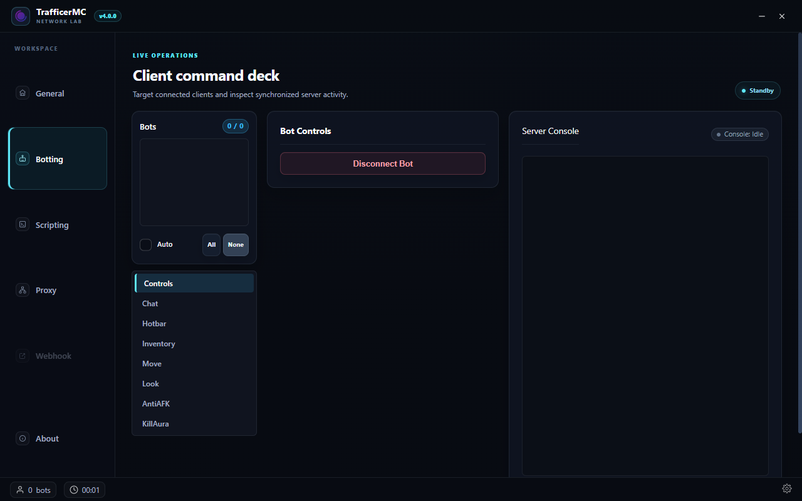
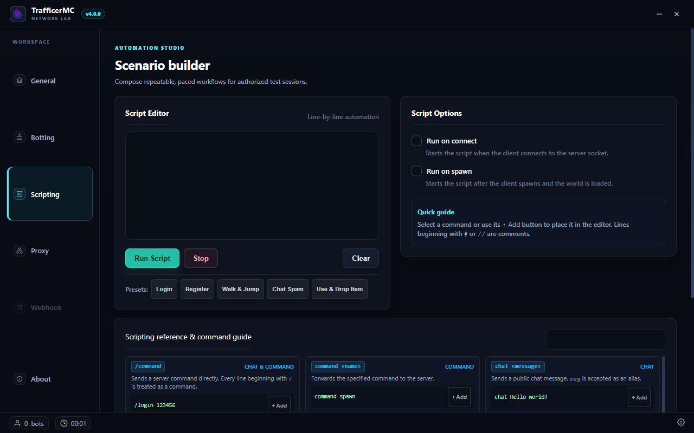
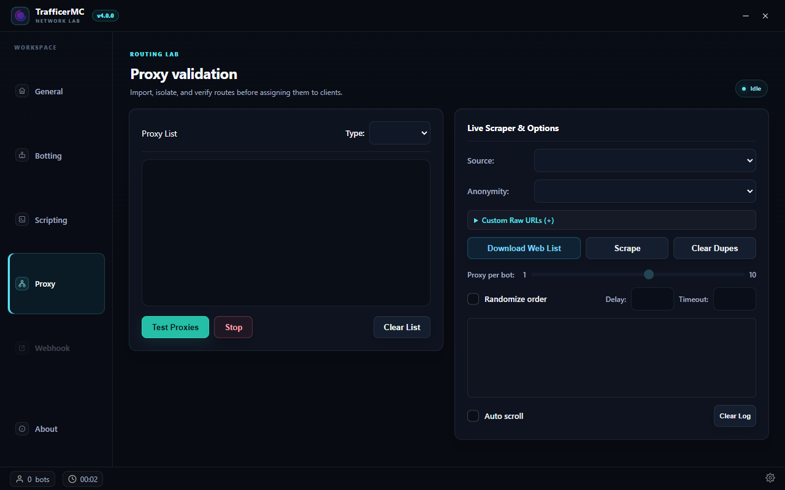
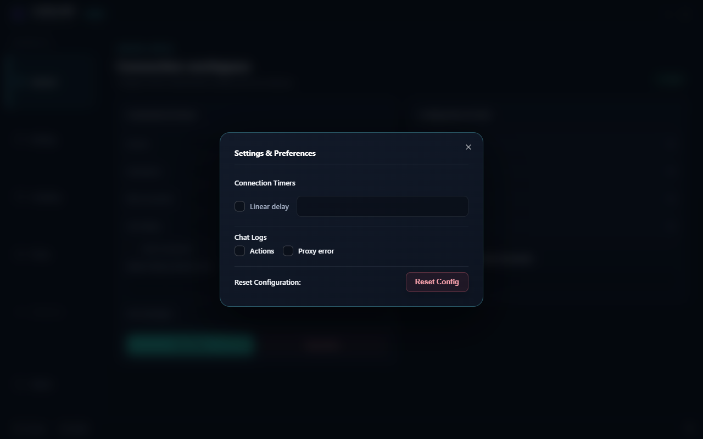

<p align="center">
  
</p>

<h1 align="center">TrafficerMC</h1>

<p align="center"><strong>Authorized Minecraft client and network testing tool</strong></p>

<p align="center">
  <a href="https://github.com/siberanka/TrafficerMC/releases/tag/v4.0.0"></a>
  <a href="https://github.com/siberanka/TrafficerMC/releases/download/v4.0.0/TrafficerMC.4.0.0.exe"></a>
  <a href="https://github.com/siberanka/TrafficerMC/releases/tag/v4.0.0"></a>
  <a href="https://github.com/siberanka/TrafficerMC/blob/main/LICENSE"></a>
</p>

> [!WARNING]
> Use TrafficerMC only on servers and proxy infrastructure you own or are explicitly authorized to test. Do not use it for disruption, unsolicited load, credential collection, access-control bypass, ban evasion, or attacks on public services. You are responsible for permission, rate limits, privacy, and applicable law.

TrafficerMC helps server owners reproduce client, authentication, proxy, chat, command, inventory, and automation behavior in controlled Minecraft test environments. Start with one client, keep conservative delays, monitor the server, and stop immediately if the target becomes unhealthy.

## Current release

Version **4.0.0** introduces the redesigned desktop workspace, reliable persisted-settings migration, and the stabilized client/network mechanics developed throughout the 3.6 line. See [CHANGELOG.md](CHANGELOG.md) for the complete verification record.

Native protocol support follows the installed Mineflayer/minecraft-protocol stack: **1.7 through 26.1**, with protocol-equivalent patch aliases such as 1.21.7 → 1.21.8 and 1.21.10 → 1.21.9. Minecraft 26.2 uses a different protocol and is not silently downgraded to 26.1. Use it only after the upstream stack adds native support; a ViaVersion bridge may connect but is not considered full compatibility.

## Features

- Protocol-safe, per-client queued chat and command delivery.
- AuthMe 6 configuration-phase pre-join dialog automation, including the corrected length-prefixed NBT response.
- Chat/title/actionbar automation for AuthMe, nLogin, OpeNLogin, LoginSecurity, LimboAuth, LibreLogin, mLogin, and JPremium-style `/login` and `/register` prompts.
- Proxy/backend transfer handling without duplicate teleport confirmations.
- Configurable randomized reconnect delay on the main connection card (safe default: 8-15 seconds).
- HTTP CONNECT and SOCKS proxy support and isolated proxy checking.
- Anti-AFK, inventory/hotbar controls, movement, scripting, and multi-client management.
- Bounded, frame-batched UI logs to avoid unbounded DOM growth and long rendering frames.
- Premium desktop workspace with clearer hierarchy, compact status feedback, and privacy-safe documentation previews.

Authentication prompts are server-configurable, so compatibility means the standard command/form flows covered by the test matrix. Captcha, TOTP, recovery codes, custom PIN keyboards, and server-specific challenges intentionally require an explicit integration.

## Local test networks

The repository contains two isolated profiles under [`test/networks`](test/networks):

- `direct`: a real local Paper backend with AuthMe 6 pre-join registration, chat echo, and command-response verification.
- `proxy`: a deterministic TCP proxy-transfer harness plus an opt-in real Velocity process with two local backends; both verify `/server`, re-authentication, and disconnect detection.

Ordinary tests do not contact public Minecraft servers and do not contain production credentials.

```powershell
npm install
npm test
npm run build
```

The opt-in direct live test expects the authorized local Paper/AuthMe fixture on `127.0.0.1:25577`:

```powershell
node test/networks/direct/authmePaperLive.test.js
```

See the README in each network profile for fixture details. Server binaries, worlds, databases, logs, and secrets belong in ignored `test/runtime/`; never commit them.

## Development

Requires Node.js 18 or newer and Git.

```powershell
git clone https://github.com/siberanka/TrafficerMC.git
cd TrafficerMC
npm install
npm run dev
```

Packaging is available through `npm run build:win`, `npm run build:linux`, `npm run build:mac`, or `npm run build:unpack`. CI/CD is not required to run or validate the project.

## Interface preview

All previews are generated from an isolated empty profile. No local server address, username, password, proxy, script, or saved setting is included.

| Connection workspace                    | Client command deck                     |
| --------------------------------------- | --------------------------------------- |
|  |  |

| Automation studio                           | Proxy validation                    |
| ------------------------------------------- | ----------------------------------- |
|  |  |

| Preferences                                  |
| -------------------------------------------- |
|  |

## License and attribution

TrafficerMC is distributed under the [MIT License](LICENSE). The copyright notice for original author **RattlesHyper (2022)** is preserved in the license and distributions. This fork is maintained by [siberanka](https://github.com/siberanka/TrafficerMC). Third-party runtime components remain under their respective licenses; see [THIRD_PARTY_LICENSES.md](THIRD_PARTY_LICENSES.md).
